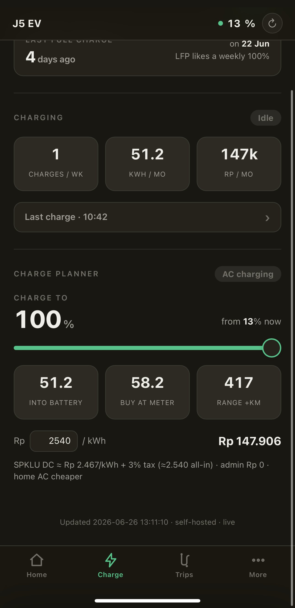
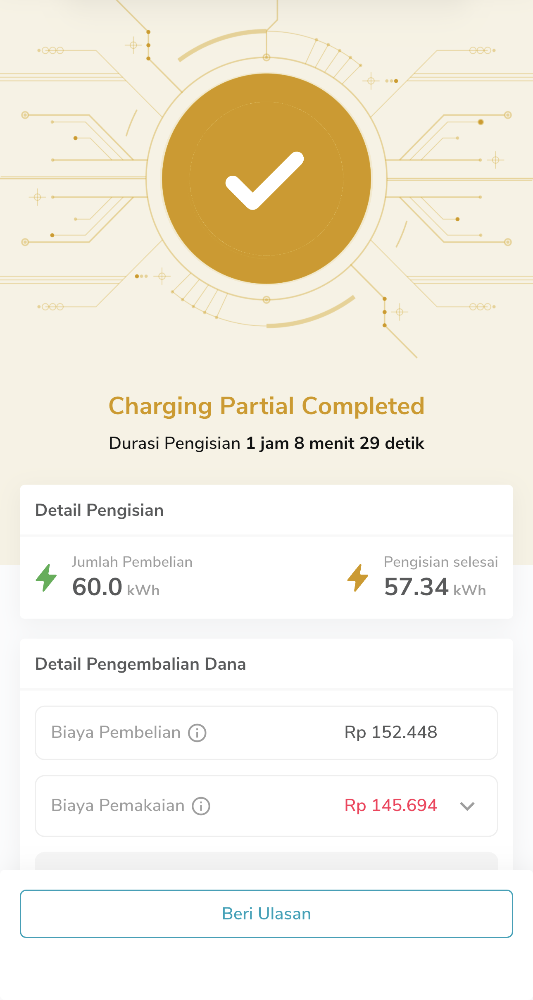

# Dashboard J5 EV — dashboard telematik self-hosted untuk Jaecoo J5 EV

[English](README.md) · **Bahasa Indonesia**

PWA mobile-first yang nampilin angka **asli** yang sebenernya udah dikirim mobilmu —
baterai, jarak tempuh, odometer, sesi pengisian, efisiensi, status ban, kesehatan aki 12 V,
log perjalanan, biaya seumur pakai, perencana pengisian untuk perjalanan jauh, dan peta SPKLU
interaktif.

Ini dibikin karena app bawaan CarLinko nyembunyiin sebagian besar info ini (ban cuma
"normal/abnormal", ga ada total perjalanan, ga ada riwayat biaya charge, ga ada perencana
trip). Semua di sini diturunkan dari data yang **memang sudah** dikirim mobil ke cloud-nya —
project ini cuma baca akunmu sendiri dan nampilinnya dengan benar.

> Dibangun & divalidasi pada satu mobil nyata. Output biaya charge cocok dengan struk PLN
> Mobile pemiliknya sampai **99,6–99,9 %** (lihat [Akurasi](#akurasi)).

## Screenshot

| Dashboard | Pengisian |
| :---: | :---: |
|  |  |
| **Perencana perjalanan** | **Peta SPKLU** |
|  |  |

*Plat & VIN disembunyikan secara default (tombol mata privasi). Tema terang yang ditampilkan —
tema gelap & toggle bahasa EN/ID juga sudah ada.*

---

## ⚠️ Legal & etika — baca ini dulu

Ini project **interoperability / reverse-engineering pribadi** untuk akses **mobil dan akunmu
sendiri**. Disediakan untuk keperluan edukasi & pribadi.

- **Pakai hanya dengan akun dan mobil milikmu sendiri.** Jangan akses data orang lain.
- Ini ngobrol sama **API vendor yang privat & tak terdokumentasi**. **Tanpa garansi** dan bisa
  rusak kapan saja kalau vendor mengubah backend-nya. **Tidak berafiliasi, tidak didukung**
  oleh Jaecoo, Chery, maupun CarLinko.
- **Tidak ada data pribadi yang disertakan.** Akun, token, VIN, plat, vehicle id, dan device
  serial-mu cuma ada di `creds.json` yang gitignored (lihat [Setup](#setup)). Kunci penanda-tangan
  request itu **konstanta app** (string yang sama di tiap install CarLinko, gampang dibaca dari
  APK) — di-bundle biar setup cukup email + password; itu bukan rahasia yang terikat ke kamu.
- **Jangan jalankan ini sebagai layanan publik/multi-user.** Itu berarti menyimpan kredensial
  orang lain (yang bisa membuka/mengontrol mobil mereka) dan hampir pasti melanggar ketentuan
  vendor. Deployment yang dimaksud adalah **satu instance per pemilik**, self-hosted, privat
  (mis. di belakang Tailscale). Lihat [Menuju multi-user](#menuju-multi-user).
- Read-only by design. Kontrol jarak jauh kendaraan **tidak** diimplementasikan.

Kalau ga setuju sama poin di atas, jangan dipakai.

---

## Fitur

- **Status live** — baterai %, jarak, odometer, 12 V, status online/parkir/charging/jalan,
  ditarik dari WebSocket realtime dan disimpan di SQLite.
- **Pengisian** — sesi charge terdeteksi otomatis (kWh masuk pack, kWh dibayar di meteran,
  biaya), grafik kurva charge, jumlah mingguan/bulanan, dan perencana "isi sampai X %" dengan
  tarif SPKLU asli. Lonjakan regen difilter biar ga ngotorin riwayat charge.
- **Efisiensi & perjalanan** — kWh/100 km per-trip & rata-rata bergulir dengan pengaman jujur,
  total kWh / biaya / km seumur pakai, dan hemat vs bensin pakai harga BBM Indonesia asli.
- **Perencana perjalanan jauh** — set start/finish, dapat titik charge di sepanjang rute yang
  diukur supaya tiba dengan margin aman (gaya ABRP), lengkap tipe konektor / kW / ketersediaan
  live dari Google.
- **Peta SPKLU** — geser peta interaktif, ketuk charger untuk konektor, ketersediaan live, dan
  petunjuk arah (gaya PLN Mobile), data dari Google Places.
- **Perawatan baterai, hitung mundur servis, tampilan ban, toggle privasi, dark mode, i18n EN/ID.**

Lihat [PRODUCT.md](PRODUCT.md) untuk alasan produk dan [DESIGN.md](DESIGN.md) untuk sistem visual.

## Arsitektur

```
  TCU mobil ─(seluler)─> cloud CarLinko ──┐
                                          │  WebSocket (auth token, tanpa signing) — blob telemetri
   tools/logger.py  ◀──────────────────────┘  decode + simpan tiap frame ke carlinko.db
        │                                      (auth.py auto-refresh token saat kedaluwarsa)
        ▼
   carlinko.db (SQLite)
        │
        ▼
   tools/server.py  ── /api/summary, /api/trip, /api/spklu ──▶  web/ PWA (vanilla JS, Leaflet)
   (http.server stdlib)        + Google Places (opsional)        disajikan lewat Tailscale
```

- **Tanpa framework, tanpa build step.** Backend pakai pustaka standar Python; frontend HTML/CSS/JS
  tulis tangan dengan dua lib vendored (Leaflet, slot-text). Self-hosted & ramah offline.
- **Telemetrinya blob 73 byte.** Offset field dipetakan dengan cara nyetir mobil dan ngeliat byte
  mana yang berubah (baterai = byte 28, range = 29–30 BE, odometer = 18–20 BE, …).
  Lihat [docs/api-map.md](docs/api-map.md).

## Akurasi

Analitik charge dikalibrasi terhadap struk PLN Mobile asli si pemilik:

| Sesi               | Dashboard            | Struk                | Cocok   |
| ------------------ | -------------------- | -------------------- | ------- |
| 58 → 100 %         | 28,9 kWh / Rp 73.491 | 28,94 kWh / Rp 73.521 | 99,9 % |
| 35 → 80 %          | 29,1 kWh / Rp 73.981 | 29,23 kWh / Rp 74.273 | 99,6 % |

Efisiensi charge DC dimodelkan tergantung SoC (isi sampai 100 % rugi lebih banyak dari sampai
80 %), dikalibrasi ke dua struk. Pack terpakai ≈ 58,9 kWh.

Perencana charge memperkirakan yang benar-benar kamu bayar di meteran, dicek terhadap struk
SPKLU PLN Mobile asli:

| Perencana charge di app | Struk PLN Mobile asli |
| :---: | :---: |
|  |  |

App memperkirakan **58,2 kWh** untuk dibeli di meteran @ **Rp 2.540/kWh**; struk menunjukkan
**57,34 kWh** yang benar-benar terkirim pada tarif all-in **Rp 2.540/kWh** yang sama — harga
per-kWh-nya pas dan volumenya meleset ~1,5 % (sesi di struk berhenti sedikit sebelum penuh).
Hitungan refund-nya juga cocok: beli Rp 152.448, terpakai Rp 145.694.

## Setup

### Prasyarat
- Python 3.10+, `pip install requests websocket-client`
- Akun CarLinko yang ada mobilmu
- (opsional) Google Maps API key untuk perencana trip / peta SPKLU

Tanpa capture app, tanpa MITM, tanpa decompile — cukup login pakai akunmu. (Kunci penanda-tangan
sudah di-bundle, dan blob `v-data` yang dikirim app ternyata diabaikan server, jadi dibuang.)

### Pakai akun kedua (disarankan)
CarLinko cuma izinin **satu sesi aktif per akun**, jadi login dashboard bisa nge-logout app
resmi-mu. Hindari bentrok dengan kasih dashboard **akun CarLinko-nya sendiri**:

1. Bikin akun CarLinko kedua (email beda).
2. Dari akun utama, **Me → Authorisation → +** lalu authorise email akun kedua ke mobilmu.
3. Login-kan dashboard ke akun kedua; app tetap di akun utama.

> Catatan: layar *Authorisation* di app menyebut berbagi kontrol Bluetooth — pastikan akun yang
> di-authorise juga bisa narik mobil lewat **cloud** (jalankan `python setup.py` di akun itu; kalau
> auto-deteksi nemu mobilnya, berarti aman). Kalau ga bisa, alternatifnya pakai satu akun saja dan
> terima sesekali login ulang.

### Cara cepat — Docker (disarankan)
```bash
docker compose up -d        # lalu buka http://localhost:8088
```
Pas pertama buka, dashboard nampilin **halaman login** — isi **email + password** CarLinko-mu,
nanti dia login dan **auto-deteksi mobilmu** (vehicle id, device SN, VIN, plat, model). Selesai.
Lebih suka terminal? `docker compose run --rm web python setup.py` melakukan hal yang sama secara
interaktif. Semua yang persisten (creds, token, database) ada di `./data`.

### Cara cepat — Python (tanpa Docker)
```bash
pip install requests websocket-client
cd tools
python setup.py                # konfigurasi interaktif + login + auto-deteksi mobil
python logger.py --adaptive    # rekam telemetri (cepat saat aktif, lambat saat parkir)
python server.py 8088          # dashboard di http://<host>:8088
```
Ga mau pakai helper? `cp creds.example.json tools/creds.json && chmod 600 tools/creds.json`
lalu isi manual. `creds.json` dan `token.txt` gitignored — jangan pernah di-commit.

Untuk selalu-nyala, pasang unit systemd yang disediakan
([carlinko-logger.service](tools/carlinko-logger.service),
[carlinko-web.service](tools/carlinko-web.service)) dan akses dashboard lewat Tailscale supaya
tetap privat tanpa mengekspos apa pun ke internet.

### Referensi `creds.json`
| key | wajib | apa |
| --- | --- | --- |
| `email`, `password` | ✅ | login CarLinko-mu (plaintext via TLS; disimpan lokal saja) |
| `region` | | region API, default `sea` |
| `vehicle_id`, `device_sn` | auto | vehicle id + serial device — **`setup.py` yang ngisiin** |
| `vehicle` | auto | `{plate, model, vin}` — auto-deteksi; UI sembunyiin plat+VIN default |
| `battery_kwh`, `wltp_kwh_100`, `tariff_idr` | | override per-model / lokal (default ke nilai J5) |
| `gmaps_key` | | Google Maps key — aktifin perencana trip + peta SPKLU (kalau ga, fallback OSM) |

## Menuju multi-user

Ini sengaja **single-tenant per instance**. Cara bersih biar pemilik lain bisa pakai adalah
dengan **tiap orang menjalankan instance-nya sendiri** dengan `creds.json` masing-masing —
bukan nge-host satu layanan yang menyimpan kredensial semua orang. Model berbeda bisa override
`battery_kwh` / `wltp_kwh_100` / `tariff_idr`, dan nama/VIN/plat kendaraan datang dari
`creds.json`, jadi app-nya udah adaptif per mobil.

## Struktur project
- `tools/` — backend Python (`server.py`, `logger.py`, `auth.py`, `setup.py`) + utilitas reverse-engineering
- `web/` — PWA-nya (satu `index.html` + `leaflet.*` & `slot-text.js` vendored)
- `docs/` — peta API dan catatan signing hasil decompile (rahasia sudah diredaksi)
- `PRODUCT.md`, `DESIGN.md` — catatan produk + desain visual

## Lisensi
[MIT](LICENSE). Tidak berafiliasi dengan Jaecoo, Chery, maupun CarLinko. Merek dagang milik pemiliknya masing-masing.
