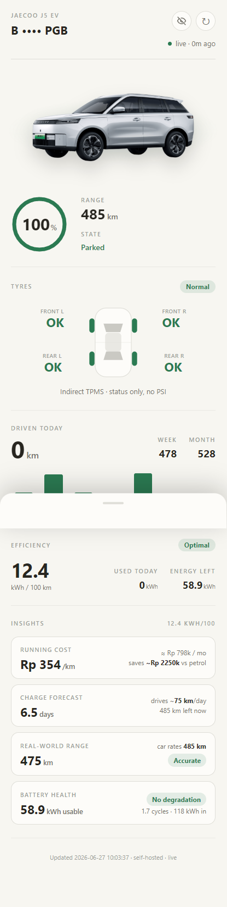
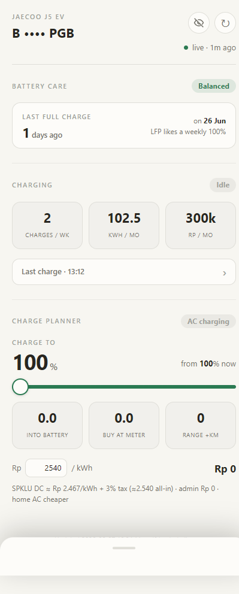
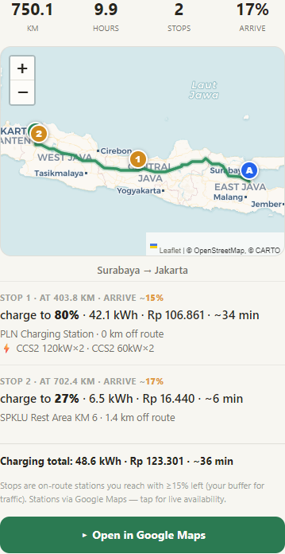
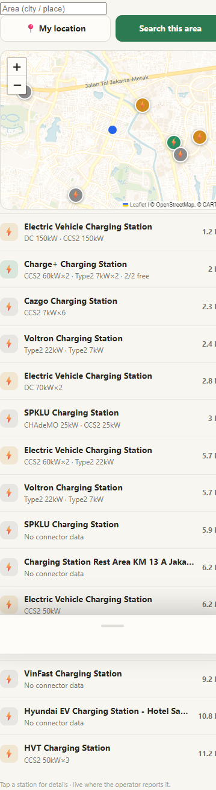

# J5 EV Dashboard — a self-hosted telematics dashboard for the Jaecoo J5 EV

A clean, mobile-first PWA that shows the **real** numbers your car already reports —
battery, range, odometer, charging sessions, efficiency, tyre status, 12 V health, trip
log, lifetime cost, a long-trip charge planner, and an interactive SPKLU (EV charger) map.

It exists because the stock CarLinko app hides most of this (tyres only show
"normal/abnormal", there are no trip totals, no charge-cost history, no road-trip planner).
Everything here is derived from data the car **already** sends to its own cloud — this
project just reads your own account and presents it properly.

> Built and validated against a single real car. Charge-cost output matches the owner's
> PLN Mobile receipts to **99.6–99.9 %** (see [Accuracy](#accuracy)).

## Screenshots

| Dashboard | Charging |
| :---: | :---: |
|  |  |
| **Trip planner** | **SPKLU map** |
|  |  |

*Plate and VIN are masked by default (privacy eye-toggle). Light theme shown — a dark theme and EN/ID language toggle are built in.*

---

## ⚠️ Legal & ethics — read this first

This is a **personal interoperability / reverse-engineering** project for accessing **your
own vehicle and your own account**. It is provided for educational and personal use.

- **Use it only with an account and a car you own.** Do not access anyone else's data.
- This talks to a **private, undocumented vendor API**. There is **no warranty** and it can
  break at any time if the vendor changes their backend. It is **not affiliated with,
  endorsed by, or supported by** Jaecoo, Chery, or CarLinko.
- **No secrets are shipped.** The request-signing key, device identity blob, token, VIN,
  plate, vehicle id and device serial are **not** in this repo — you supply your own in a
  gitignored `creds.json` (see [Setup](#setup)).
- **Do not run this as a public/hosted multi-user service.** Doing so means storing other
  people's credentials (which can unlock/control their car) and almost certainly violates the
  vendor's terms. The intended deployment is **one instance per owner**, self-hosted, private
  (e.g. behind Tailscale). See [Going multi-user](#going-multi-user).
- Read-only by design. Remote control of the vehicle is **not** implemented.

If you don't accept the above, don't use this.

---

## Features

- **Live status** — battery %, range, odometer, 12 V, online/parked/charging/driving state,
  pulled from the realtime WebSocket and cached in SQLite.
- **Charging** — auto-detected charge sessions (kWh into pack, kWh billed at the meter, cost),
  a charge-curve chart, weekly/monthly counts, and a "charge to X %" planner with real SPKLU
  tariffs. Regen blips are filtered out so they don't pollute charge history.
- **Efficiency & trips** — per-trip and rolling kWh/100 km with honest guards, lifetime kWh /
  cost / km, and savings vs petrol at real Indonesian fuel prices.
- **Long-trip planner** — set start/finish, get on-route charge stops sized to arrive with a
  safety margin (ABRP-style), with real connector type / kW / live availability from Google.
- **SPKLU map** — pan an interactive map, tap a charger for connectors, live availability and
  directions (PLN-Mobile-style), data from Google Places.
- **Battery care, service countdown, tyre view, privacy toggles, dark mode, EN/ID i18n.**

See [PRODUCT.md](PRODUCT.md) for the product rationale and [DESIGN.md](DESIGN.md) for the
visual system.

## Architecture

```
  Car TCU ──(cellular)──> CarLinko cloud  ──┐
                                            │  WebSocket (token auth, no signing) — telemetry blob
   tools/logger.py  ◀───────────────────────┘  decodes + stores every frame to carlinko.db
        │                                       (auth.py auto-refreshes the token on expiry)
        ▼
   carlinko.db (SQLite)
        │
        ▼
   tools/server.py  ── /api/summary, /api/trip, /api/spklu ──▶  web/ PWA (vanilla JS, Leaflet)
   (stdlib http.server)        + Google Places (optional)        served over Tailscale
```

- **No framework, no build step.** Backend is Python standard library; frontend is hand-written
  HTML/CSS/JS with two vendored libs (Leaflet, slot-text). Self-hosted and offline-friendly.
- **The telemetry is a 73-byte blob.** Field offsets were recovered by driving the car and
  watching which bytes moved (battery = byte 28, range = 29–30 BE, odometer = 18–20 BE, …).
  See [docs/api-map.md](docs/api-map.md).

## Accuracy

The charge analytics are calibrated against the owner's real PLN Mobile receipts:

| Session            | Dashboard            | Receipt              | Match   |
| ------------------ | -------------------- | -------------------- | ------- |
| 58 → 100 %         | 28.9 kWh / Rp 73,491 | 28.94 kWh / Rp 73,521 | 99.9 % |
| 35 → 80 %          | 29.1 kWh / Rp 73,981 | 29.23 kWh / Rp 74,273 | 99.6 % |

DC charge efficiency is modelled as SoC-dependent (charging to 100 % loses more than to 80 %),
calibrated to two receipts. Usable pack ≈ 58.9 kWh.

## Setup

### Prerequisites
- Python 3.10+, `pip install requests websocket-client`
- A CarLinko account + a car bound to it
- (optional) a Google Maps API key for the trip planner / SPKLU map
- A way to intercept your own app traffic once (see below)

### First-time capture (the one manual step)
The vendor API signs every request and pins identity with a device blob. You extract two
values **from your own app, once**:

1. **`sign_key`** — the HMAC key the app uses to sign requests. It lives in the app binary;
   recover it by decompiling `libapp.so` (this repo used [Blutter](https://github.com/worawit/blutter);
   the offset is documented in [docs/decompiled/secure_request_utils.dart](docs/decompiled/secure_request_utils.dart)).
2. **`v_data`** — the constant base64 device-identity blob sent with every request. Capture it
   by MITM-ing your own app (Flutter ignores the system proxy + trust store, so use
   [reFlutter](https://github.com/Impact-I/reFlutter) + an emulator with `-http-proxy` + mitmproxy /
   HTTP Toolkit). The same capture also reveals your `vehicle_id` and `device_sn`.

### Configure
```bash
cp creds.example.json tools/creds.json
chmod 600 tools/creds.json
# fill in: email, password, sign_key, v_data, vehicle_id, device_sn, vehicle{}, gmaps_key
```
`creds.json` and `token.txt` are gitignored — never commit them.

### Run
```bash
cd tools
python auth.py                 # logs in, writes token.txt
python logger.py --loop 600    # poll + record telemetry (or run as a service)
python server.py 8088          # dashboard at http://<host>:8088
```
For always-on use, install the provided units
([carlinko-logger.service](tools/carlinko-logger.service),
[carlinko-web.service](tools/carlinko-web.service)) and reach the dashboard over Tailscale so
it stays private without exposing anything to the internet.

### `creds.json` reference
| key | required | what |
| --- | --- | --- |
| `email`, `password` | ✅ | your CarLinko login (plaintext over TLS; stored locally only) |
| `region` | | API region, default `sea` |
| `sign_key` | ✅ | request-signing HMAC key (extract from your app) |
| `v_data` | ✅ | constant device-identity blob (capture once) |
| `vehicle_id`, `device_sn` | ✅ | your vehicle id + device serial (from the capture) |
| `vehicle` | | `{plate, model, vin}` for display (UI hides plate+VIN by default) |
| `battery_kwh`, `wltp_kwh_100`, `tariff_idr` | | per-model / local overrides (default to J5 values) |
| `gmaps_key` | | Google Maps key — enables trip planner + SPKLU map (else OSM fallback) |

## Going multi-user

This is intentionally **single-tenant per instance**. The clean way to let other owners use
it is to have **each of them run their own instance** with their own `creds.json` — not to
host one service holding everyone's credentials. Different models can override
`battery_kwh` / `wltp_kwh_100` / `tariff_idr`, and the vehicle name/VIN/plate come from
`creds.json`, so the app already adapts per car.

## Project layout
- `tools/` — Python backend (`server.py`, `logger.py`, `auth.py`) + reverse-engineering utilities
- `web/` — the PWA (single `index.html` + vendored `leaflet.*`, `slot-text.js`)
- `docs/` — API map and decompiled signing notes (secrets redacted)
- `PRODUCT.md`, `DESIGN.md` — product + visual design notes

## License
[MIT](LICENSE). Not affiliated with Jaecoo, Chery, or CarLinko. Trademarks belong to their owners.
